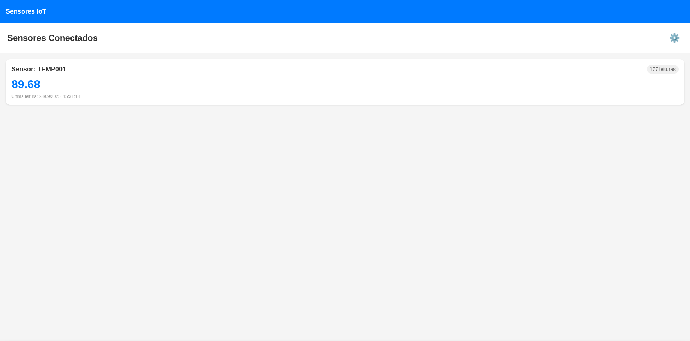
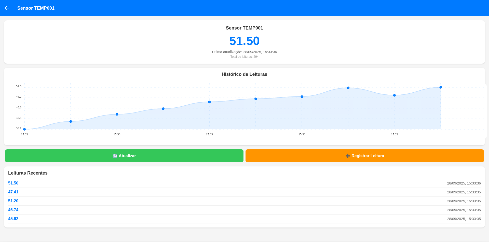
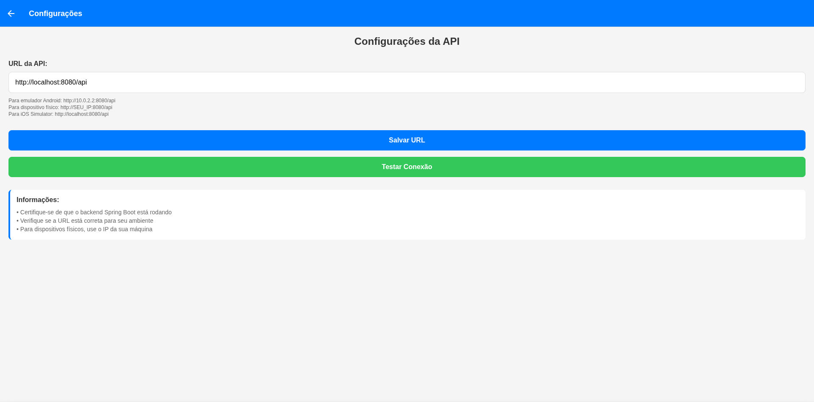
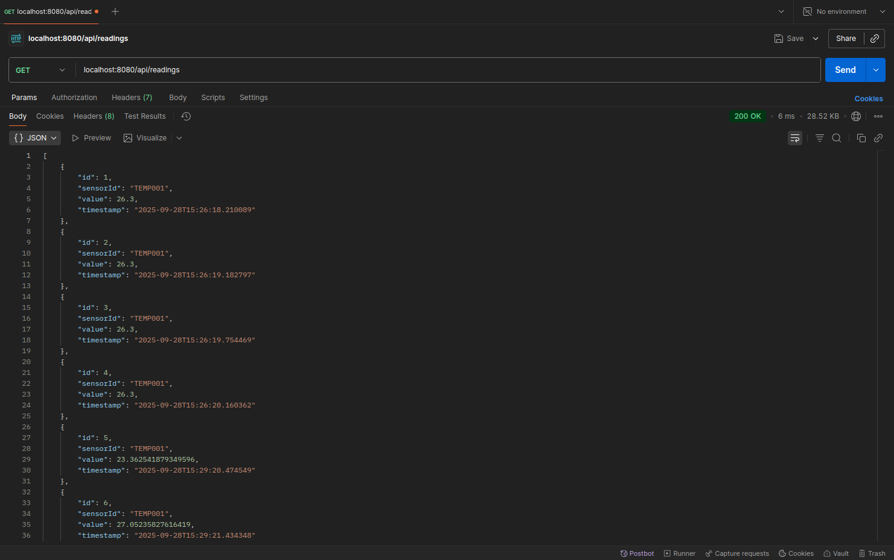
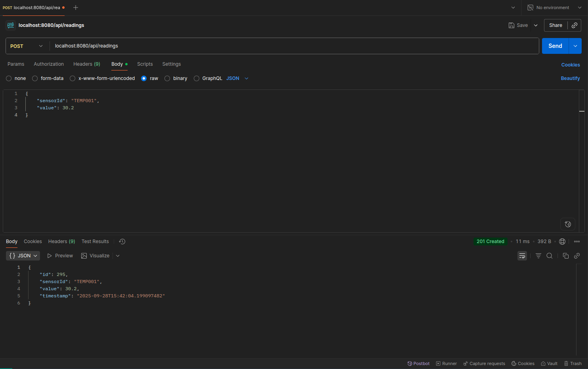

# Sistema IoT Sensor Monitor

## Integrantes

- **Caio Caram de Souza** - RM: 552248
- **Isabella Ventura Diaz** - RM: 551793
- **Lucas Gabriel Gianini Moreira** - RM: 99921
- **Maria Eduarda de Carvalho Goda** - RM: 552276
- **Maria Eloisa da Silva Santos** - RM: 552294

## Instruções para Execução

### Backend e Frontend em Conjunto

1. **Iniciar o Backend:**
```bash
cd back-end
./mvnw spring-boot:run
```

2. **Iniciar o Frontend:**
```bash
cd front-end
npm install
npm start
```

3. **Configurar no App:**
- Abrir o app React Native
- Ir em Configurações
- Definir URL da API conforme ambiente:
  - Emulador Android: `http://10.0.2.2:8080/api`
  - iOS Simulator: `http://localhost:8080/api`
  - Dispositivo físico: `http://[SEU_IP]:8080/api`
- Testar conexão

## Exemplos de Chamadas de API

### POST /api/readings
```bash
curl -X POST http://localhost:8080/api/readings \
  -H "Content-Type: application/json" \
  -d '{"sensorId": "TEMP001", "value": 25.5}'
```

**Resposta:**
```json
{
  "id": 1,
  "sensorId": "TEMP001",
  "value": 25.5,
  "timestamp": "2024-12-28T10:30:00.123456"
}
```

### GET /api/readings
```bash
curl -X GET http://localhost:8080/api/readings
```

**Resposta:**
```json
[
  {
    "id": 1,
    "sensorId": "TEMP001",
    "value": 25.5,
    "timestamp": "2024-12-28T10:30:00.123456"
  }
]
```

### GET /api/readings/{sensorId}
```bash
curl -X GET http://localhost:8080/api/readings/TEMP001
```

**Resposta:**
```json
[
  {
    "id": 1,
    "sensorId": "TEMP001",
    "value": 25.5,
    "timestamp": "2024-12-28T10:30:00.123456"
  }
]
```

## Prints das Telas

### Tela de Lista de Sensores



### Tela de Detalhes



### Tela de Configurações



### Requisição GET



### Requisição POST

